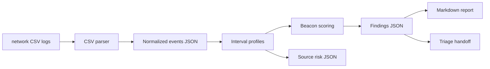

# Architecture

Beaconing Traffic Detector is a defensive lab for identifying periodic outbound callback behavior from timestamped network logs.

## Current MVP

- Parses timestamped network CSV logs.
- Groups outbound traffic by source, destination, port, and protocol.
- Calculates average interval, min/max interval, jitter, and consistency.
- Scores periodic callback behavior and assigns confidence.
- Emits events, interval profiles, summary, source risk, findings, report, and triage artifacts.

## Future Product Shape

- Configurable scoring by protocol and expected polling patterns.
- Allowlist and suppression workflow for known SaaS or telemetry services.
- Dashboard charts for interval consistency and source/destination timelines.
